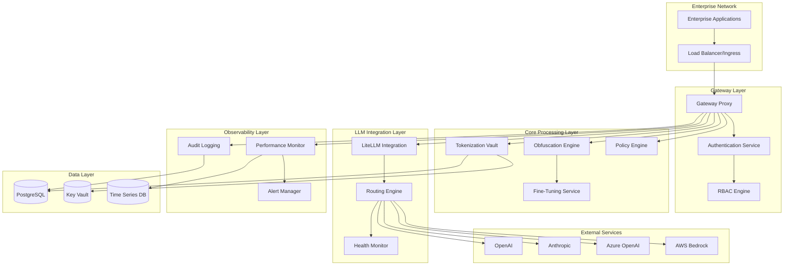

# Design Document

## Overview

Phase 2 transforms the Enterprise Data Obfuscation Gateway from an MVP proof-of-concept into a production-ready enterprise platform. Building upon the existing microservices architecture (Gateway Proxy, Obfuscation Engine, Tokenization Vault, LiteLLM Integration, Policy Engine, and Audit Logging), this phase introduces advanced enterprise features including intelligent multi-LLM routing, comprehensive RBAC, enhanced policy management with web UI, secure fine-tuning capabilities, advanced monitoring, and Kubernetes orchestration.

The design maintains the core architectural principles of the Phase 1 implementation while significantly enhancing security, scalability, observability, and operational capabilities to meet enterprise production requirements.

## Architecture

### High-Level System Architecture

The Phase 2 architecture extends the existing microservices pattern with additional enterprise components:



### Service Communication Patterns

**Synchronous Communication:**
- Gateway Proxy orchestrates all service interactions via HTTP/REST APIs
- Authentication and authorization checks occur before each service call
- Circuit breaker patterns protect against service failures

**Asynchronous Communication:**
- Audit events are published to message queues for reliable logging
- Performance metrics are streamed to time-series database
- Alert notifications use event-driven patterns

**Data Flow Security:**
- All inter-service communication uses mTLS encryption
- Service mesh (Istio) provides traffic management and security policies
- Zero-trust networking with service-to-service authentication

## Components and Interfaces

### Enhanced Gateway Proxy

**Responsibilities:**
- Request/response orchestration with enhanced error handling
- Authentication and authorization enforcement
- Rate limiting and traffic shaping
- Circuit breaker implementation for external services
- Request/response correlation and tracing

**New Interfaces:**
```python
# Enhanced authentication middleware
@app.middleware("http")
async def auth_middleware(request: Request, call_next):
    # JWT validation, RBAC checks, audit logging
    pass

# Circuit breaker for external services
@app.post("/chat/completions")
async def chat_completions(request: ChatRequest):
    # Implement circuit breaker pattern
    # Route through obfuscation pipeline
    # Handle failover scenarios
    pass
```

### Multi-LLM Routing Engine

**Responsibilities:**
- Intelligent routing based on prompt analysis, cost, and performance
- Provider health monitoring and automatic failover
- Load balancing across multiple providers
- Cost tracking and budget enforcement

**Core Components:**
```python
class RoutingEngine:
    def __init__(self):
        self.providers = {}
        self.health_monitor = HealthMonitor()
        self.cost_tracker = CostTracker()
    
    async def route_request(self, prompt: str, routing_rules: dict) -> str:
        # Analyze prompt for routing hints
        # Check provider health and availability
        # Apply cost and performance optimization
        # Return selected provider
        pass
```

**Routing Strategies:**
- **Content-based routing:** Route based on prompt analysis (technical, creative, analytical)
- **Performance-based routing:** Route to fastest available provider
- **Cost-based routing:** Route to most cost-effective provider
- **Failover routing:** Automatic failover to backup providers
- **Load balancing:** Distribute requests across healthy providers

### Advanced Policy Engine with Web UI

**Enhanced Architecture:**
```python
class PolicyEngine:
    def __init__(self):
        self.rule_engine = RuleEngine()
        self.policy_store = PolicyStore()
        self.validation_engine = ValidationEngine()
    
    async def apply_policies(self, text: str, context: dict) -> PolicyResult:
        # Real-time policy application
        # Context-aware rule evaluation
        # Conflict resolution
        pass
```

**Web UI Components:**
- **Policy Management Dashboard:** Visual rule creation and editing
- **Rule Testing Sandbox:** Test policies against sample data
- **Policy Version Control:** Track changes and rollback capabilities
- **Compliance Reporting:** Generate policy compliance reports

**Policy Rule Types:**
- **Regex-based rules:** Pattern matching for structured data
- **NER-based rules:** Named entity recognition rules
- **Context-aware rules:** Rules that consider surrounding context
- **Custom ML rules:** Machine learning-based detection rules

### Secure Fine-Tuning Service

**Architecture:**
```python
class FineTuningService:
    def __init__(self):
        self.model_manager = ModelManager()
        self.training_pipeline = TrainingPipeline()
        self.validation_engine = ValidationEngine()
    
    async def fine_tune_model(self, training_data: str, config: dict) -> str:
        # Secure data handling
        # LoRA/PEFT implementation
        # Model validation and testing
        # Deployment pipeline
        pass
```

**Security Features:**
- **Data isolation:** Training data never leaves secure environment
- **Encrypted storage:** All model weights encrypted at rest
- **Access controls:** Fine-grained permissions for model management
- **Audit trails:** Complete logging of all fine-tuning activities

### Comprehensive RBAC Implementation

**Role Hierarchy:**
```yaml
roles:
  super_admin:
    permissions: ["*"]
  
  security_admin:
    permissions:
      - "policy:read"
      - "policy:write"
      - "audit:read"
      - "rbac:manage"
  
  data_scientist:
    permissions:
      - "model:read"
      - "model:fine_tune"
      - "policy:test"
  
  operator:
    permissions:
      - "gateway:read"
      - "monitoring:read"
  
  user:
    permissions:
      - "gateway:use"
```

**Permission Model:**
- **Resource-based permissions:** Fine-grained access to specific resources
- **Action-based permissions:** Control over specific operations
- **Context-aware permissions:** Permissions based on request context
- **Time-based permissions:** Temporary access grants

### Enhanced Audit Logging and Compliance

**Audit Architecture:**
```python
class AuditLogger:
    def __init__(self):
        self.storage = TamperEvidenceStorage()
        self.crypto = CryptographicSigning()
        self.indexer = AuditIndexer()
    
    async def log_event(self, event: AuditEvent) -> str:
        # Cryptographic signing
        # Tamper-evident storage
        # Real-time indexing
        pass
```

**Audit Event Types:**
- **Authentication events:** Login, logout, failed attempts
- **Authorization events:** Permission grants, denials
- **Data access events:** PII detection, obfuscation, de-obfuscation
- **Policy events:** Rule changes, policy applications
- **System events:** Service starts, stops, errors

**Compliance Features:**
- **Immutable logs:** Cryptographically signed audit trails
- **Retention policies:** Automated log archival and deletion
- **Compliance reports:** GDPR, HIPAA, SOX reporting
- **Forensic capabilities:** Detailed investigation tools

### Performance Monitoring and Observability

**Monitoring Stack:**
```python
class PerformanceMonitor:
    def __init__(self):
        self.metrics_collector = MetricsCollector()
        self.tracer = DistributedTracer()
        self.alerter = AlertManager()
    
    async def collect_metrics(self, service: str, operation: str, duration: float):
        # Collect performance metrics
        # Generate distributed traces
        # Trigger alerts if needed
        pass
```

**Key Metrics:**
- **Latency metrics:** Request/response times across all services
- **Throughput metrics:** Requests per second, tokens processed
- **Error metrics:** Error rates, failure types
- **Resource metrics:** CPU, memory, disk usage
- **Business metrics:** Cost per request, accuracy metrics

**Alerting Rules:**
- **Performance alerts:** High latency, low throughput
- **Error alerts:** High error rates, service failures
- **Security alerts:** Unauthorized access, policy violations
- **Business alerts:** Budget overruns, accuracy degradation

## Data Models

### Enhanced Token Mapping Model

```sql
CREATE TABLE token_mappings (
    id UUID PRIMARY KEY DEFAULT gen_random_uuid(),
    original_data TEXT NOT NULL,
    token VARCHAR(255) UNIQUE NOT NULL,
    synthetic_data TEXT,
    entity_type VARCHAR(100),
    context_hash VARCHAR(64),
    created_at TIMESTAMP DEFAULT NOW(),
    expires_at TIMESTAMP,
    access_count INTEGER DEFAULT 0,
    last_accessed TIMESTAMP,
    encryption_key_id VARCHAR(255),
    tenant_id VARCHAR(255),
    INDEX idx_token (token),
    INDEX idx_context (context_hash),
    INDEX idx_tenant (tenant_id)
);
```

### Policy Rules Model

```sql
CREATE TABLE policy_rules (
    id UUID PRIMARY KEY DEFAULT gen_random_uuid(),
    name VARCHAR(255) NOT NULL,
    description TEXT,
    rule_type VARCHAR(50) NOT NULL,
    pattern TEXT,
    entity_types TEXT[],
    action VARCHAR(50) NOT NULL,
    priority INTEGER DEFAULT 0,
    enabled BOOLEAN DEFAULT true,
    created_by VARCHAR(255),
    created_at TIMESTAMP DEFAULT NOW(),
    updated_at TIMESTAMP DEFAULT NOW(),
    version INTEGER DEFAULT 1,
    tenant_id VARCHAR(255)
);
```

### Audit Events Model

```sql
CREATE TABLE audit_events (
    id UUID PRIMARY KEY DEFAULT gen_random_uuid(),
    event_type VARCHAR(100) NOT NULL,
    event_data JSONB NOT NULL,
    user_id VARCHAR(255),
    session_id VARCHAR(255),
    ip_address INET,
    user_agent TEXT,
    timestamp TIMESTAMP DEFAULT NOW(),
    signature VARCHAR(512),
    tenant_id VARCHAR(255),
    INDEX idx_event_type (event_type),
    INDEX idx_timestamp (timestamp),
    INDEX idx_user (user_id),
    INDEX idx_tenant (tenant_id)
);
```

### LLM Provider Configuration Model

```sql
CREATE TABLE llm_providers (
    id UUID PRIMARY KEY DEFAULT gen_random_uuid(),
    name VARCHAR(255) NOT NULL,
    provider_type VARCHAR(100) NOT NULL,
    endpoint_url TEXT NOT NULL,
    api_key_encrypted TEXT,
    model_configs JSONB,
    routing_weight INTEGER DEFAULT 1,
    max_requests_per_minute INTEGER,
    cost_per_token DECIMAL(10,6),
    enabled BOOLEAN DEFAULT true,
    health_check_url TEXT,
    last_health_check TIMESTAMP,
    health_status VARCHAR(50),
    tenant_id VARCHAR(255)
);
```

## Error Handling

### Circuit Breaker Pattern

```python
class CircuitBreaker:
    def __init__(self, failure_threshold: int = 5, timeout: int = 60):
        self.failure_threshold = failure_threshold
        self.timeout = timeout
        self.failure_count = 0
        self.last_failure_time = None
        self.state = "CLOSED"  # CLOSED, OPEN, HALF_OPEN
    
    async def call(self, func, *args, **kwargs):
        if self.state == "OPEN":
            if time.time() - self.last_failure_time > self.timeout:
                self.state = "HALF_OPEN"
            else:
                raise CircuitBreakerOpenError()
        
        try:
            result = await func(*args, **kwargs)
            if self.state == "HALF_OPEN":
                self.state = "CLOSED"
                self.failure_count = 0
            return result
        except Exception as e:
            self.failure_count += 1
            self.last_failure_time = time.time()
            if self.failure_count >= self.failure_threshold:
                self.state = "OPEN"
            raise e
```

### Graceful Degradation

**Service Degradation Levels:**
1. **Full functionality:** All services operational
2. **Reduced functionality:** Non-critical features disabled
3. **Core functionality:** Only essential obfuscation/de-obfuscation
4. **Emergency mode:** Basic pass-through with logging

**Fallback Strategies:**
- **Provider fallback:** Automatic failover to backup LLM providers
- **Model fallback:** Use simpler models if advanced models fail
- **Rule fallback:** Use basic regex if ML-based detection fails
- **Cache fallback:** Serve cached responses when possible

### Error Response Formats

```python
class ErrorResponse(BaseModel):
    error_code: str
    error_message: str
    error_details: Optional[dict] = None
    request_id: str
    timestamp: datetime
    retry_after: Optional[int] = None
```

## Testing Strategy

### Unit Testing

**Coverage Requirements:**
- Minimum 90% code coverage for all services
- 100% coverage for security-critical components
- Comprehensive edge case testing

**Testing Framework:**
```python
# Example test structure
class TestObfuscationEngine:
    def test_pii_detection_accuracy(self):
        # Test PII detection with various formats
        pass
    
    def test_synthetic_data_generation(self):
        # Test quality of synthetic replacements
        pass
    
    def test_context_preservation(self):
        # Test that context is maintained
        pass
```

### Integration Testing

**Service Integration Tests:**
- End-to-end workflow testing
- Service communication testing
- Database integration testing
- External API integration testing

**Security Integration Tests:**
- Authentication and authorization flows
- Encryption and decryption processes
- Audit logging verification
- RBAC enforcement testing

### Performance Testing

**Load Testing:**
- Concurrent user simulation
- High-volume request testing
- Resource utilization monitoring
- Scalability testing

**Stress Testing:**
- System breaking point identification
- Recovery testing
- Failover scenario testing
- Resource exhaustion testing

### Security Testing

**Penetration Testing:**
- API security testing
- Authentication bypass attempts
- Authorization escalation testing
- Data exposure testing

**Compliance Testing:**
- GDPR compliance verification
- HIPAA compliance testing
- SOX compliance validation
- Industry-specific compliance testing

### Deployment Testing

**Kubernetes Testing:**
- Pod startup and shutdown testing
- Service discovery testing
- ConfigMap and Secret management
- Rolling update testing

**Infrastructure Testing:**
- Network connectivity testing
- Storage persistence testing
- Backup and recovery testing
- Disaster recovery testing