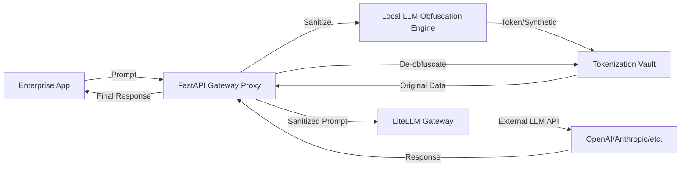

# Enterprise Data Obfuscation Gateway – Specification & Implementation Plan

## 1. Overview

A FastAPI/Python-based reverse proxy and obfuscation gateway for secure, context-preserving use of external LLMs in enterprise environments. Integrates LiteLLM for multi-provider LLM routing. All components are Python microservices, containerized and orchestrated for on-prem or private cloud deployment.

---

## 2. High-Level Architecture

- **Gateway Proxy (FastAPI/Python):** Intercepts LLM API calls, orchestrates obfuscation, de-obfuscation, and LLM routing.
- **Local LLM Obfuscation Engine (Python):** Detects and transforms sensitive data using regex, spaCy, and HuggingFace Transformers. Supports LoRA/PEFT fine-tuning.
- **Tokenization Vault (Python):** Secure microservice with PostgreSQL (pgcrypto) for mapping original ↔ token ↔ synthetic data. Optionally integrates HashiCorp Vault for key management.
- **LiteLLM Integration (Python):** Unified, OpenAI-compatible API gateway for routing sanitized prompts to multiple LLM providers.
- **Policy Engine (Python):** Admin-defined rules for sensitive data detection and obfuscation strategies.
- **Audit Logging & Observability (Python):** OpenTelemetry, ELK, or cloud-native logging. Immutable, tamper-evident logs.
- **RBAC & Security Controls (Python):** Oso or similar for RBAC, end-to-end TLS, strict API authentication.

---

## 3. Component Specifications

### 3.1 Gateway Proxy (FastAPI)
- **Responsibilities:** HTTP reverse proxy, request/response interception, orchestration of obfuscation, de-obfuscation, and LLM API calls.
- **Key Interfaces:** REST endpoints for prompt submission, admin/config, health checks.
- **Security:** TLS, JWT/OAuth2, RBAC.

### 3.2 Local LLM Obfuscation Engine
- **Responsibilities:** PII/quasi-identifier detection (regex, spaCy NER, LLM), synthetic data generation, token assignment.
- **Tech:** Python, HuggingFace Transformers, spaCy, LoRA/PEFT for fine-tuning.
- **Customization:** Secure, in-situ fine-tuning for customer-specific data.

### 3.3 Tokenization Vault
- **Responsibilities:** Store and retrieve mappings (original ↔ token ↔ synthetic).
- **Tech:** Python microservice, PostgreSQL (pgcrypto), optional HashiCorp Vault.
- **Security:** Encryption at rest, external key management, strict RBAC, immutable audit logs.

### 3.4 LiteLLM Integration
- **Responsibilities:** Route sanitized prompts to external LLMs, manage retries, cost tracking, unified API.
- **Tech:** Python, LiteLLM (open-source core).

### 3.5 Policy Engine
- **Responsibilities:** Define and enforce sensitive data detection/obfuscation rules.
- **Tech:** Python, integrated with obfuscation engine and proxy.
- **Phase 1 Implementation:** Extended rules include obfuscating emails, phone numbers, personal names, credit cards, passports, South African IDs, policy numbers, membership numbers, medical terms, and vehicle registration numbers.

### 3.6 Audit Logging & Observability
- **Responsibilities:** Log all transformations, accesses, and admin actions.
- **Tech:** Python with SQLite persistent storage, verbose host-accessible logs synced to `logs/audit_service.log` via Docker bind mount.
- **Phase 1 Implementation:** Logs to console and file, immediate flush after writes.

### 3.7 RBAC & Security Controls
- **Responsibilities:** Fine-grained access control for all APIs and admin functions.
- **Tech:** Oso (Python), FastAPI dependencies.
- **Planned for Phase 2.**

---

## 4. Phased Implementation Roadmap

### Phase 1: MVP – "Prove the Core Workflow" (Completed)
- Set up **all microservice scaffolding** and containerization with Docker Compose.
- Implement Gateway Proxy, Local LLM Obfuscation Engine, Tokenization Vault, LiteLLM Integration (with GPU-accelerated Ollama Mistral model), Policy Engine, and Audit Logging.
- Ensure bind-mounted logging directory `logs/` to persist logs to host machine.
- Verify end-to-end routing and obfuscation via Gateway.

### Phase 2: Enterprise Readiness – "Build the Platform" (Next)
- Multi-LLM support via LiteLLM with intelligent routing.
- Advanced policy engine with admin UI and runtime rule updates.
- Secure, in-situ fine-tuning for obfuscation LLM.
- Full RBAC, detailed audit logs, compliance features.
- Performance monitoring and observability.
- Kubernetes manifests for orchestration.

### Phase 3: Market Leadership – "Expand the Moat"
- Semantic caching, intelligent LLM routing.
- Advanced synthetic data engine.
- Adversarial LLM for vulnerability probing.
- SIEM/DLP integrations, plugin ecosystem.

---

## 5. High-Level Architecture Diagram

---

## 6. Technology Stack Summary

- **Language:** Python (all components)
- **Frameworks:** FastAPI, HuggingFace Transformers, spaCy, LiteLLM, Oso, OpenTelemetry
- **Database:** PostgreSQL (pgcrypto), optional HashiCorp Vault
- **Deployment:** Docker, Kubernetes/OpenShift, on-prem or private cloud

---

## 7. Compliance & Security

- End-to-end encryption (TLS)
- Immutable, tamper-evident audit logs
- RBAC for all APIs and admin functions
- Data residency controls
- Designed for GDPR, CCPA, HIPAA compliance

---

## 8. References

- See `RESEARCH.md` for full strategic, technical, and regulatory context.